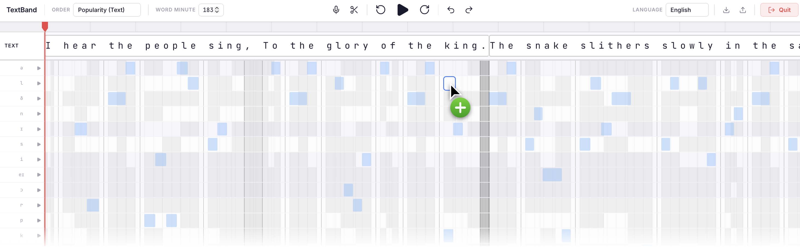

# TextBand

**A DAW-inspired text editor for phonetic-aware writing.**



TextBand reimagines text editing through the lens of music production. Text blocks behave like audio clips on a timeline, each word is decomposed into its phonemes (IPA), and a MIDI-style piano roll lets you *paint* phonetic constraints to reshape your writing, choosing words that sound the way you want.

---

## Features

| Feature | Description |
|---|---|
| **Timeline Text Track** | Drag, reorder, split, merge, and resize text blocks on a DAW-style timeline |
| **Phoneme MIDI Grid** | Visualize every word's phonemes (IPA) on a piano roll to paint constraints to filter synonyms |
| **Synonym Engine** | LLM-powered contextual synonyms with phonetic segmentation (begin, mid, end) |
| **Speech-to-Text** | Whisper-powered voice input to create text blocks |
| **Multi-language** | English and French support (phonemization, dictionaries, IPA charts) |
| **Playhead & Loop** | Audio playback of IPA sounds with looping regions |
| **Import and Export** | Save and load your projects as JSON |
| **LLM Text Operations** | AI-powered merge, split, and time-stretch (density adjustment) |

---

## Quick Start

### Prerequisites

- **Python 3.10+** with `pip`
- **Node.js 18+** with `npm`
- **LM Studio** (optional — only needed for local LLM mode)

### 1. Clone & install

```bash
# Backend
cd backend
python3 -m venv venv
source venv/bin/activate
pip install -r requirements.txt

# Frontend
cd ../frontend
npm install
```

### 2. Configure environment

Create a single `.env` file at the root of the project (`textband V2/.env`). This file is automatically synced to the backend and frontend configurations when using the launcher script.

```env
# Choose your active LLM provider: "local" (or "lmstudio"), "mistral", or "openai"
LLM_PROVIDER=local

# LM Studio (local settings)
LM_STUDIO_URL=http://127.0.0.1:1234/v1/chat/completions
LM_STUDIO_MODEL_FAST=qwen/qwen3-1.7b
LM_STUDIO_MODEL_LARGE=openai/gpt-oss-20b

# Mistral API settings
MISTRAL_API_KEY=your_mistral_key
MISTRAL_MODEL=mistral-large-2411

# OpenAI API settings
OPENAI_API_KEY=your_openai_key
OPENAI_MODEL=gpt-4o-mini
```

### 3. Launch

**Option A: One command (recommended):**

```bash
chmod +x start.sh
./start.sh
```

**Option B: Manual (two terminals):**

```bash
# Terminal 1: Backend
cd backend
source venv/bin/activate
python server.py --port 8000

# Terminal 2: Frontend
cd frontend
npm run dev
```

### 4. Open

Visit **[http://localhost:3000](http://localhost:3000)** in your browser.

> **Note:** If using `LLM_PROVIDER=local`, make sure LM Studio is running on `http://localhost:1234` with a loaded model before launching.

---

## LLM Provider Modes

TextBand uses LLMs for two independent purposes:
- **Backend LLM**: Contextual synonym generation
- **Frontend LLM**: Text merge, split, time-stretch

Both are configured simultaneously from the single root `.env` file via `LLM_PROVIDER`.

### Available providers

| Provider | Value | Requires |
|---|---|---|
| **LM Studio** (local) | `local` (or `lmstudio`) | LM Studio running locally |
| **Mistral API** | `mistral` | `MISTRAL_API_KEY` |
| **OpenAI API** | `openai` | `OPENAI_API_KEY` |

### Scenario 1: 100% Local (Default, requires LM Studio running)

If you don't want to use any paid cloud APIs:
- **`root .env`**:
  ```env
  LLM_PROVIDER=local
  ```

### Scenario 2: 100% API (Fastest, no local LLM startup required)

If you want to run entirely via cloud APIs without launching LM Studio:
- **`root .env`**:
  ```env
  LLM_PROVIDER=mistral # or openai
  ```

